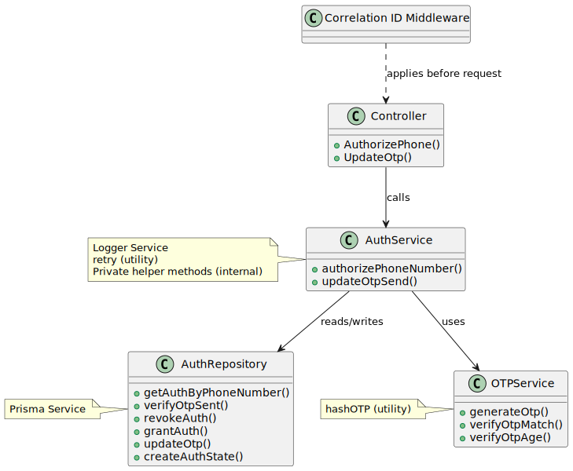

# Core Services

## Ride Request Service

### 1. Overview

**Purpose:**

* Acts as the core ride request maintenance module for the Golle platform.

**Role in Golle App:**

* Provides all CRUD functionality needed by the other modules to interact with a ride request throughout the lifecycle of a ride

**Goals:**

* Provide functionality to accommodate both stateless and stateful clients (SMS+Web/Mobile)
* Provide strong validation for both inbound and outbound payloads to ensure data correctness
* Offer clear API boundaries for orchestration and other services

**Tech Stack:**

* **Language:** Node.js with TypeScript
* **Framework:** Express.js
* **Database:** Supabase
* **Transport:** REST (JSON over HTTPS)

***

### 2. Architecture & Diagrams

1. **Component Diagram**


2. **Ride Lifecycle Flow**
   1. Create Ride Request

      * **Receive Request** – The service accepts a POST /golle/ride-request request containing ride request details in JSON.

      * **Insert Ride** – The API inserts a new ride request record into the database.

      * **Confirm Creation** – The database returns the ride ID to the API.

      * **Respond to Client** – The API responds with 201 Created and a confirmation message.
   2. Update Ride Request

      * **Receive Request** – The service accepts a PATCH /golle/ride-request request containing \{action, message}.

      * **Validate Action** – The API validates the action key and dynamically selects the validation schema and correct handler.

      * **Update Ride** – The API updates the corresponding ride request record in the database.

      * **Confirm Update** – The database returns confirmation of the update.

      * **Respond to Client** – The API responds with 200 OK, the action key used, and an update message.
   3. Get Ride Request

      * **Receive Request** – The service accepts a GET /golle/ride-request request containing \{rideId}.

      * **Fetch Ride** – The API queries the database for the ride record.

      * **Return Data** – The database returns the ride data.

      * **Respond to Client** – The API responds with 200 OK and the ride request JSON.
   4. Delete Ride Request

      * **Receive Request** – The service accepts a DELETE /golle/ride-request request containing \{rideId}.

      * **Delete Ride** – The API deletes the ride record from the database.

      * **Confirm Deletion** – The database returns confirmation of deletion.

      * **Respond to Client** – The API responds with 200 OK and a ride deleted message.

***

### 3. API Endpoints

1. **Create Ride Request**
   POST `/golle/ride-request`

```json
{
  "riderId": "user_15523",
  "driverId": "driver_9876555542",
  "passengerQty": 3,
  "tripType": 2,
  "waitTime": 15,
  "pickupDisplayName": "TEST LOCATION",
  "pickupFormattedAddress": "123 Main St, Springfield, IL 62701",
  "pickupStreetNumber": "123",
  "pickupRoute": "Main St",
  "pickupCity": "Springfield",
  "pickupState": "OH",
  "pickupZip": "48599",
  "pickupLat": 40.7817,
  "pickupLng": -85.6501,
  "pickupConfirmed": true,

  "dropoffDisplayName": "Central Park",
  "dropoffFormattedAddress": "456 Park Ave, Springfield, IL 62704",
  "dropoffStreetNumber": "456",
  "dropoffRoute": "Park Ave",
  "dropoffCity": "Springfield",
  "dropoffState": "IL",
  "dropoffZip": "62704",
  "dropoffLat": 39.7833,
  "dropoffLng": -89.6436,
  "dropoffConfirmed": true,

  "status": "ACTIVE"
}
```

Response:

* 201 Created - Ride Request Created

```json
{
    "success": "success",
    "data": {
        "message": "Ride c93563df-f55a-44b2-8054-191870b598c7 has been created"
    }
}
```

2. **Get A Ride Request**
   GET `/golle/ride-request`

```json
{
    "rideId": "d6733304-0c05-4786-ab2e-16efb9a061ef"
}
```

Response:

* 200 OK - Ride Request Found

```json
{
    "success": true,
    "data": {
        "id": "d6733304-0c05-4786-ab2e-16efb9a061ef",
        "riderId": "user_15523",
        "passengerQty": 3,
        "tripType": "ROUND_TRIP",
        "waitTime": 30,
        "pickupDisplayName": "TEST LOCATION",
        "pickupFormattedAddress": "123 Main St, Springfield, IL 62701",
        "pickupStreetNumber": "123",
        "pickupRoute": "Main St",
        "pickupCity": "Springfield",
        "pickupState": "OH",
        "pickupZip": "48599",
        "pickupLat": 40.7817,
        "pickupLng": -85.6501,
        "pickupConfirmed": true,
        "dropoffDisplayName": "Central Park",
        "dropoffFormattedAddress": "456 Park Ave, Springfield, IL 62704",
        "dropoffStreetNumber": "456",
        "dropoffRoute": "Park Ave",
        "dropoffCity": "Springfield",
        "dropoffState": "IL",
        "dropoffZip": "62704",
        "dropoffLat": 39.7833,
        "dropoffLng": -89.6436,
        "dropoffConfirmed": true,
        "status": "ACTIVE"
    }
}
```

3. **Delete Ride Request**
   DELETE `/golle/ride-request`

```json
{
    "rideId": "c93563df-f55a-44b2-8054-191870b598c7"
}
```

Response:

* 200 OK - Ride Request Deleted

```json
{
    "success": true,
    "data": {
        "message": "Ride c93563df-f55a-44b2-8054-191870b598c7 has been deleted"
    }
}
```

4. **Update Ride Request**
   PATCH `/golle/ride-request`

* This is where SMS comes in. There is a map of action keys that is utilized to map request to both validation schemas and business logic handlers. Below is a list of all valid keys:
  ASK_PASSENGERS
  ASK_PICKUP_LOCATION
  ASK_DROPOFF_LOCATION
  ASK_TRIP_TYPE
  ASK_WAIT_TIME

```json
{
    "riderId": "user_15523",
    "action": "ASK_WAIT_TIME",
    "message": 30
}
```

Response:

* 200 Created - Ride Request Updated

```json
{
    "success": true,
    "data": {
        "promptAction": "ASK_WAIT_TIME",
        "message": "Updated wait time for ride 77730c9e-054e-42c2-9b32-012c2cfe6f96 to 30!"
    }
}
```

Errors:
The Ride Request Service returns structured JSON responses for errors. Examples:

| HTTP Status | Error Type                              | Example JSON Response                                                                                                                                          |
| ----------- | --------------------------------------- | -------------------------------------------------------------------------------------------------------------------------------------------------------------- |
| 400         | Prisma Validation Error                 | `{ "status": 400, "message": "Invalid data for database operation", "stack": "stacktrace unavailable" }`                                                       |
| 404         | Record Not Found (Prisma P2025)         | `{ "status": 404, "message": "Record not found", "stack": "stacktrace unavailable" }`                                                                          |
| 404         | NotFoundError (Custom)                  | `{ "status": 404, "message": "Ride request with ID 123 not found", "stack": "stacktrace unavailable" }`                                                        |
| 409         | Unique Constraint Failed (Prisma P2002) | `{ "status": 409, "message": "A record with this value already exists", "stack": "stacktrace unavailable", "details": { "target": ["userId","rideId"] } }`     |
| 422         | RideIncompleteError                     | `{ "status": 422, "message": "Cannot complete ride request: missing fields", "stack": "stacktrace unavailable", "details": ["pickupLocation","destination"] }` |
| 422         | UnconfirmedLocationError                | `{ "status": 422, "message": "Ride request cannot be processed: location not confirmed", "stack": "stacktrace unavailable" }`                                  |
| 500         | Internal Server Error                   | `{ "status": 500, "message": "Internal server error", "stack": "stacktrace unavailable" }`                                                                     |

### 4. Security Considerations

* **Request Validation:** All incoming payloads are validated against DTOs to prevent injection attacks and malformed requests.
* **Authentication & Authorization:** All requests are authenticated and authorized via the Golle Security Service API before reaching this service.
* **Logging & Correlation:** Logs include correlation IDs to enable distributed tracing without exposing sensitive data.

### 5. Performance & Scalability

* **Stateless API Layer:** Each request is independent; no client state is stored in-memory. This allows the service to be replicated across multiple nodes and scaled horizontally behind a load balancer.
* **Database-backed State:** All persistent state (e.g., ride requests, user/driver associations, etc.) is stored in the database, making instances interchangeable.
* **Horizontal Scaling:** The service is containerized and can scale out (e.g., via Kubernetes) by running multiple stateless replicas.
* **Database Efficiency:** Queries are optimized with Prisma ORM and indexed fields to minimize latency under load.
* **Fault Tolerance:** Graceful error handling and retry logic (planned) to help ensure resilience.

### 6. Testing

* **Unit Test Coverage:** All endpoints are covered by unit tests, validating both workflow correctness and service boundary contracts.
* **Demo Environment:** A live demo instance is available for manual testing at:
  `https://demo-golle-ride-request-service.onrender.com/[endpoint]`

### 7. Future Enhancements

* **Query Parameter Support:** Refactor the GET endpoint to accept `rideId` as a query parameter instead of in the request body, aligning with REST best practices.
* **Resilience via Retry Logic:** Introduce retry logic for transient failures to improve reliability in distributed environments.
* **Continuous Integration:** Implement a CI pipeline using GitHub Actions to automatically ensure stability before deployment.

## Security Service

### 1. Overview

**Purpose:**

* Acts as the core authentication and authorization module for the Golle platform.

**Role in Golle App:**

* Ensures that only verified users can interact with RideRequestService and other downstream services by managing identity, session security, and OTP-based user verification for SMS-first rideshare interactions.
* Forms the foundation for secure interactions across the Golle ecosystem.

**Goals:**

* Secure user interactions via SMS (no password requirement)
* Prevent fraudulent access, spam, and abuse
* Provide stateless, session-based security for SMS flows.
* Offer clear API boundaries for orchestration and other services

**Tech Stack:**

* **Language:** Node.js with TypeScript
* **Framework:** NestJS
* **Database:** Supabase
* **Transport:** REST (JSON over HTTPS)
* **Security:** OTP (short-lived, single-use), HMAC

***

### 2. Architecture & Diagrams

1. **Component Diagram / Service Architecture Diagram**



2. **Phone Authorization Flow**
   1. **Receive Request** – The service accepts a JSON payload containing a phone number and message.
   2. **Validate Payload** – The request body is validated for required fields and proper formatting.
   3. **Check Registration** – The service determines whether the phone number is already registered.
      * **Not Registered** → The phone number is stored and an OTP is generated and returned to the client. OTPs are not auto-applied to updates to ensure atomic operations and maintain clear boundaries between the Security Service and Orchestrator Service.
      * **Already Registered** → The service verifies the OTP by checking both expiration and message match.
   4. **Authorize Phone Number** – If validation and OTP verification succeed, the phone number is marked as authorized.

***

### 3. API Endpoints

**Note:** Responses like 200, 201, 202, 400, or 401 are expected as part of the OTP workflow; `success: true` indicates the request was processed, not that the OTP matched. Other status codes (404, 409, 500) represent exceptional conditions outside the normal flow.

1. **Authorize Phone Number**
   POST `/auth/verify-phone`

```json
{
  "phoneNumber": "3304437029",
  "message": "123456"
}
```

Response:

* 200 OK - Phone number authorized

```json
{
  "success": true,
  "data": {
    "authAction": "AUTHORIZED",
    "authStatus": true,
    "phoneNumber": "3304437029",
    "message": "Otp matched"
  }
}
```

* 201 Created - New phone registered and OTP sent for the first time

```json
{
  "success": true,
  "data": {
    "authAction": "SEND_OTP",
    "authStatus": false,
    "phoneNumber": "3304437029",
    "message": "Made first contact: created new user",
    "otp": "057668"
  }
}
```

* 400 Bad Request - OTP is expired/missing

```json
{
  "success": true,
  "data": {
    "authAction": "RESEND_OTP",
    "authStatus": false,
    "phoneNumber": "3304437029",
    "message": "Expired Otp",
    "otp": "726241"
  }
}
```

* 401 Unauthorized - Incorrect OTP

```json
{  
  "success": true,
  "data": {
    "authAction": "INCORRECT_OTP",
    "authStatus": false,
    "phoneNumber": "3304437029",
    "message": "Otp did not match"
  }
}
```

Errors:

* 404 Not Found - Phone number not found
* 409 Conflict - Phone number already exists
* 500 Internal Server Error - Unexpected server error occurred

```json
{
  "success": false,
  "error": {
    "message": "Internal server error", 
    "type": "Error"
  }
}
```

2. **Update Otp Sent**
   PATCH `/auth/update-otp`

```json
{
  "phoneNumber": "3304437029",
  "otpCode": "176874"
}
```

Response:

* 202 Accepted - OTP Sent updated successfully

```json
{
  "success": true,
  "data": {
    "phoneNumber": "3304437029",
    "message": "3304437029 updated successfully",
    "otp": "176874"
  }
}
```

Errors:

* 404 Not Found - Phone number not found
* 409 Conflict - Phone number already exists
* 500 Internal Server Error - Unexpected server error occurred

```json
{
  "success": false,
  "error": {
    "message": "Internal server error", 
    "type": "Error"
  }
}
```

### 4. Security Consideration

* **OTP storage:** OTPs are stored hashed and have a strict, short expiration time to prevent replay attacks.
* **Atomic operations:** OTP generation and phone number registration are separated from update flows to maintain clear service boundaries and avoid race conditions.
* **Request validation:** All incoming payloads are validated against DTOs to prevent injection or malformed data.
* **Authentication/Authorization:** Serves as the main gateway to Golle, preventing unauthorized interaction in downstream services.
* **Logging & correlation:** Logs include correlation IDs to trace requests without exposing sensitive data.

### 5. Testing/CI Note

* All endpoints are covered by unit tests, ensuring correctness of OTP flow and service boundaries.
* A live demo instance is available for testing endpoints at: `https://demo-golle-security-service.onrender.com/auth/[endpoint]`

### 6. Future Enhancements

* **Rate Limiting:** Limit OTP requests per phone number to prevent brute-force attacks.
* **Stateless Authorization:** Extend authorization to support web and mobile platforms, enabling future Golle expansion.
* **Phone Number Country Code:** Currently, Golle assumes all phone numbers are U.S.-based. Future versions could support international users by adding country code handling and validation for proper E.164 formatting.

## Dispatch Service

### Overview

* **Status:** Planned (design in progress)

The Dispatch Service will be responsible for assigning available drivers to ride requests. It considers rider location, driver proximity, availability, and trip type (e.g., one way or round trip). It will leverage Redis or similar in-memory stores to cache driver states and support fast, real-time matching, ensuring low-latency dispatch decisions even under heavy load.

### Role in Golle App

* Matches drivers and riders efficiently.
* Sends updates to Orchestration when a driver is assigned.
* Integrates with SMS Gateway to notify both parties.

### Goals

* Minimize rider wait time.
* Fairly distribute rides among drivers.
* Provide fallback mechanisms when no driver is available.

## Payment Service

### Overview

* **Status:** Planned (design in progress)

The Payment Service will handle all financial transactions, including trip payments, refunds, and driver payouts. It will integrate with external payment processors for security and compliance.

### Role in Golle App

* Charges riders securely after trip completion.
* Tracks balances and payouts for drivers.
* Provides receipts and payment confirmations.

### Goals

* Allow convenient payments for Amish/rural client via Interactive Voice Response (IVR) payments.
* Ensure secure, PCI-compliant payment handling.
* Provide a transparent audit trail.
* Support multiple payment methods in the future.

## Orchestration Service

### Overview

* **Status:** Planned (design in progress)

The Orchestration Service coordinates cross-service workflows, ensuring that each user action (e.g., booking a ride) triggers all necessary downstream actions (validation, dispatch, payment, notifications).

### Role in Golle App

* Acts as the central point for requests to flow through and be directed.
* Ensures consistency across services during multi-step flows.
* Provides failure recovery and retry logic for entire user actions.

### Goals

* Centralize cross-service communication.
* Enable monitoring of business workflows.
* Allow flexible scaling and new integrations in the future.

## SMS Gateway

### Overview

* **Status:** Planned (design in progress)

The SMS Gateway Service abstracts third-party providers (e.g., Twilio) and provides a unified interface for sending and receiving SMS messages.

### Role in Golle App

* Prepares SMS messages to conform to API data requirements
* Sends trip updates and confirmations to riders and drivers.
* Routes inbound SMS messages to the Orchestration Service.
* Handles provider failover (multiple SMS vendors in the future).

### Goals

* Ensure downstream JSON payload compliance.
* Provide reliability and redundancy in messaging.
* Allow easy swapping of providers.
* Centralize logging and monitoring of SMS traffic.