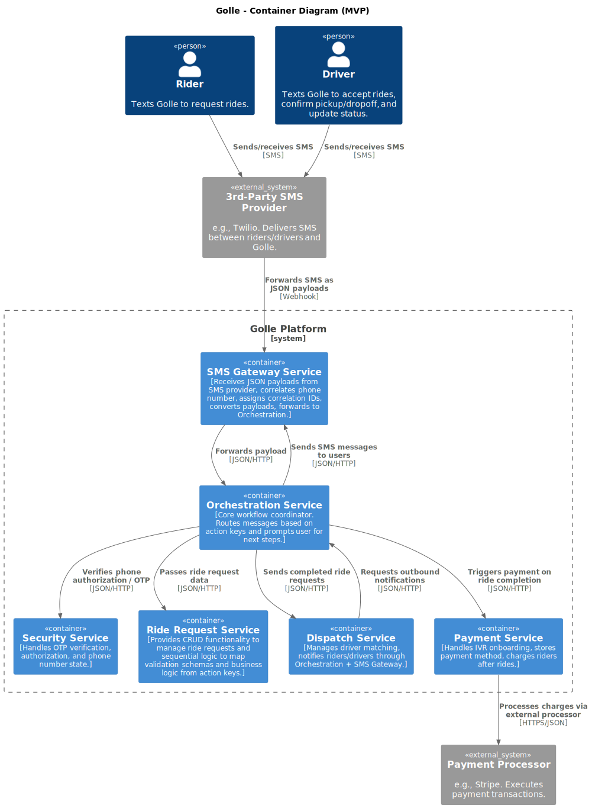

# System Overview

## High-Level Architecture

Golle consists of several core services communicating via JSON/HTTP. The **Orchestration Service** ensures all workflows are consistent and sequential across SMS interactions.

### Users

* **Riders:** Request rides.
* **Drivers:** Accept rides, update location, confirm pickups/dropoffs.

### Core Concepts

* **Action Keys:** Sequential workflow statuses guiding user prompts/interactions.
* **SMS Gateway Service:** Converts SMS payloads to standardized JSON for internal consumption.
* **Orchestration Service:** Routes messages, manages prompts, central hub for workflow logic.
* **Business Services:** Ride Request, Dispatch, Security, Payment.

### High-Level Flow

1. Rider or driver sends an SMS → SMS Provider → SMS Gateway.
2. SMS Gateway → Orchestration → relevant Business Service.
3. Responses flow back via Orchestration → SMS Gateway → User.
4. Dispatch handles asynchronous driver matching and notifications.
5. Payment triggers upon ride completion through Orchestration → Payment Service → Payment Processor.

### System Architecture Diagram
